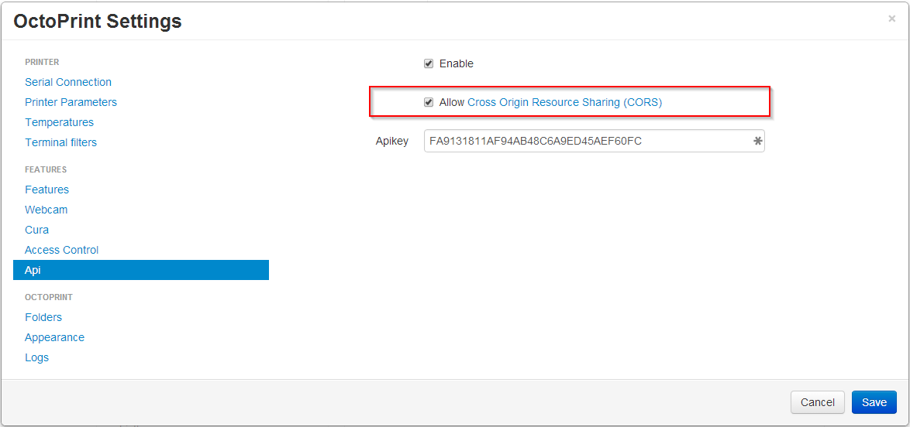

## About

This is a Python 3 script intended as command line interface for the Octoprint API. It just needs the API Key which you
can get from the Octoprint web interface and the address and port where Octoprint. You also need to enable `Cross Origin
Resource Sharing (CORS)` as you can see in the next image taken from Octoprint docs:



## Usage

```
usage: octo-control.py [-h] --apikey APIKEY --host HOST --port PORT
                       [--printer-connected] [--printer-status]
                       [--print-progress] [--total-time] [--left-time]
                       [--elapsed-time] [--printing-file]
                       [--set-bed-temp SET_BED_TEMP] [--get-bed-temp]
                       [--ext-temp] [--ext-target] [--pause] [--resume]
                       [--start] [--cancel] [--version]

optional arguments:
  -h, --help            show this help message and exit
  --apikey APIKEY       Octoprint's API Key
  --host HOST           Octoprint host address, port must not be specified
                        here
  --port PORT           Port on which Octoprint is running
  --printer-connected   Checks if there is a printer connected
  --printer-status      Gets the printer status (Operational, Disconnected,
                        ...)
  --print-progress      Gets the print progress as percentage
  --total-time          Gets the total print time in seconds
  --left-time           Gets the time left for the print to finish
  --elapsed-time        Gets the elapsed print time
  --printing-file       Gets the name of the file being printed
  --set-bed-temp SET_BED_TEMP
                        Sets the bed temperature in degrees celsius
  --get-bed-temp        Gets the current bed temperature
  --ext-temp            Gets the current extruder temperature in degrees
                        celsius
  --ext-target          Gets the target extruder temperature in degrees
                        celsius
  --pause               Pause the current job
  --resume              Resume the current job
  --start               Starts printing with the currently selected file
  --cancel              Cancel the current job
  --version             Reads Octoprint version
```
